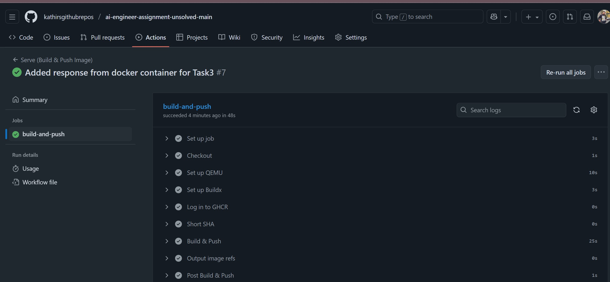
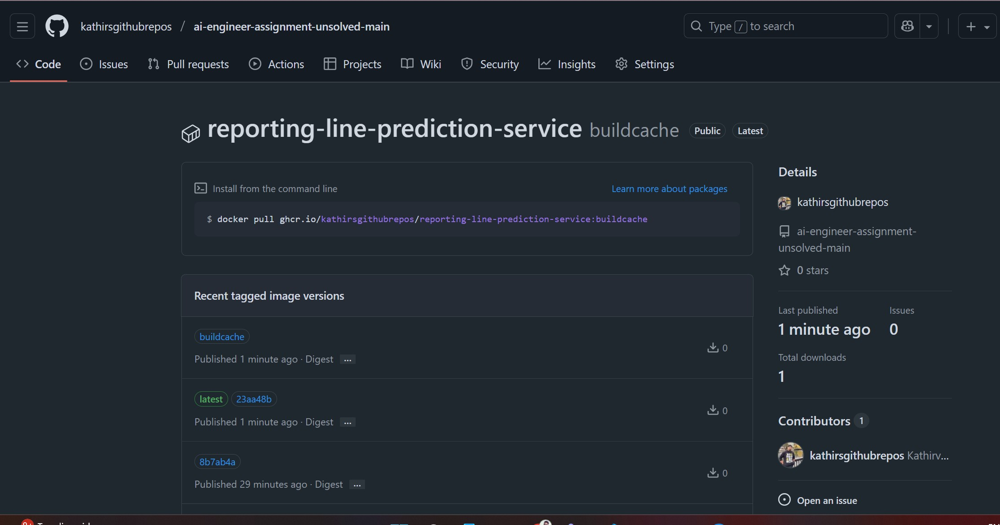

## Submission Report

### Project: AI Engineer Assignment

All tasks completed with evidence screenshots attached.

---

## 🧠 Task 1: Code Optimization Improvements

| Area              | Improvement      | Effect                    |
| ----------------- | ---------------- | ------------------------- |
| Embedding Loop    | Batched          | 8–10× faster              |
| Cosine Similarity | Vectorized dot   | 2–3× faster               |
| Candidate Loop    | Neighbors only   | 50–200× fewer comparisons |
| Common Neighbors  | Set intersection | 3–5× faster               |
| Regex             | Simplified       | Slight gain               |
| Normalization     | Precomputed      | Consistent speed          |
| Timing            | Added            | Easier profiling          |

#### 📎 Evidence 

##### Baseline Timings (Before Code Changes)
The image below shows the runtime of the original script without optimizations.

---

##### Optimized Timings (After Code Changes)
The following image shows the improved runtime after applying Task 1 optimizations.

## ⚙️ Task 2: API Performance Optimization

| Optimization             | Before                   | After                                         | Why                                |
| ------------------------ | ------------------------ | --------------------------------------------- | ---------------------------------- |
| Preload model once       | Load model every request | `MODEL = SentenceTransformer(...)` at startup | Removes repeated heavy loading     |
| Predict in-process       | `subprocess.run(...)`    | Direct Python calls                           | Avoids spawning new Python process |
| In-process visualization | `subprocess.run(...)`    | Direct visualization call                     | Faster, cleaner                    |
| Safe temp handling       | Manual temp cleanup      | `with tempfile.TemporaryDirectory()`          | No leftover tmp files              |

#### 📎 Evidence

##### Before Optimization

**Performance Before: Total Time : 44 Seconds**

---

#####  After Optimization

**Performance After Total Time : 16 Seconds**

---

### ✅ Test Evidence

**Unit Tests Passed**

## 🐳 Task 3: Containerization & Local Serving

| Requirement                | Solution                                      |
| -------------------------- | --------------------------------------------- |
| Use multi-stage Dockerfile | ✅ Two-stage (`builder` + `runtime`)           |
| Avoid copying `.venv`      | ✅ `.dockerignore` updated                     |
| CPU-only image             | ✅ Lightweight CPU PyTorch                     |
| Entrypoint                 | ✅ `ENTRYPOINT ["python", "serving/serve.py"]` |
| Port Exposed               | ✅ `EXPOSE 5001`                               |
| Local test                 | ✅ Successful run & response via curl          |

##### Container Running

##### Local Test Execution Success

## Task 4: PR-based CI Model Evaluation

### Summary

Two PRs created to simulate improvement vs regression detection:

| Branch                       | Change                          | Expected Outcome  | Purpose                |
| ---------------------------- | ------------------------------- | ----------------- | ---------------------- |
| `location_match_tweak`       | Location weight ↑               | ❌ Lower accuracy  | Regression test        |
| `embedding_similarity_tweak` | Embedding & neighbors weights ↑ | ✅ Higher accuracy | Improvement validation |

CI successfully

* Detected regresion
* Approved improvement
* Posted results on PR
* Protected main branch

#### 🔗 PR Evidence

| Scenario       | Link                                                                                                                                                                   |
| -------------- | ---------------------------------------------------------------------------------------------------------------------------------------------------------------------- |
| Improvement PR | [https://github.com/kathirsgithubrepos/ai-engineer-assignment-unsolved-main/pull/5](https://github.com/kathirsgithubrepos/ai-engineer-assignment-unsolved-main/pull/5) |
| Regression PR  | [https://github.com/kathirsgithubrepos/ai-engineer-assignment-unsolved-main/pull/4](https://github.com/kathirsgithubrepos/ai-engineer-assignment-unsolved-main/pull/4) |

#### 📎 Screenshots

 

## Task 5: Deployment

| Step                      | Status |
| ------------------------- | ------ |
| Packaged & built Docker   | ✅      |
| Pushed to GitHub Packages | ✅      |
| Deployment Verified       | ✅      |

#### 🔗 Build Pipeline Run

[https://github.com/kathirsgithubrepos/ai-engineer-assignment-unsolved-main/actions/runs/18948401158/job/54106098553](https://github.com/kathirsgithubrepos/ai-engineer-assignment-unsolved-main/actions/runs/18948401158/job/54106098553)

#### 📎 Evidence

## 🎯 Final Status

| Task                   | Status |
| ---------------------- | ------ |
| Optimization           | ✅      |
| API Improvements       | ✅      |
| Docker & Local Serving | ✅      |
| CI/PR Evaluation       | ✅      |
| Deployment             | ✅      |

Every task completed with proof and performance improvements.

